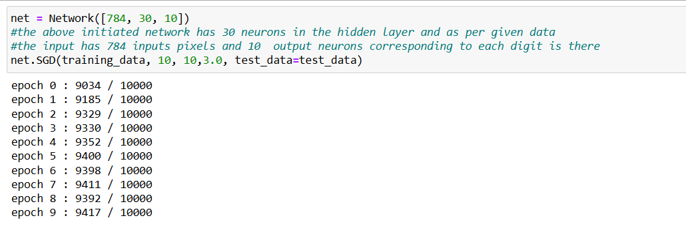
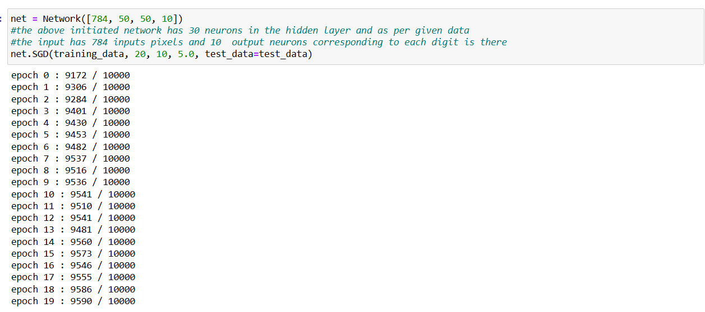

# Numpy-Neural-Network

The repository contains the code for creating a simple neural network from python and numpy

 
<h3>The initial idea  is a NN using numpy :</h3>
<ul>
<li>the project uses a spiral data generated by code</li>
<li>there can be multiple classes so to calculate the loss , we have used categorical cross entropy</li>
</ul>
<b>NOTE : We have further implement MNIST dataset to classify the 28x28 digits using NN build from numpy and maths. Have Fun !!</b>
 

Below is the progess in the round 1 of training with a simple code and less optimization

</img>

For next round we added more layers and made the learning rate half each time after 4 epochs : <b> to achieve accuracy of 95.9%</b>

</img>
Here is the link to MNIST repo -> 
<a href="https://github.com/mnielsen/neural-networks-and-deep-learning.git"> MNIST github</a>
